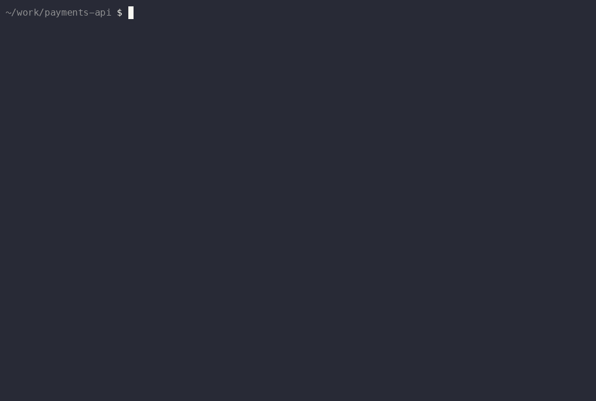

# The hero demo

`acp-local-demo.gif` is a **real recording of the real thing** — the live
`install.sh --local` fetched from agenticcontrolplane.com, the real Claude Code
and Codex CLIs, and denies coming from the actual hook path in a sandbox HOME.
Nothing is mocked or edited. For a control-layer product, a fabricated demo
would be disqualifying; if a take goes wrong, re-record it, never doctor it.

`demo.cast` is the asciinema source for the GIF — keep them in sync (re-render
with `record.sh render` whenever the cast changes).

## Re-recording

```bash
demo/record.sh prep          # fresh sandbox HOME + tiny demo repo (local bare origin)
demo/record.sh login-claude  # one-time: `claude setup-token` flow — macOS keeps /login
                             # OAuth in the Keychain, which the sandbox can't read, so
                             # the rig uses a long-lived token stored 600 inside .home/
demo/record.sh login-codex   # one-time; then run /hooks inside codex and TRUST the ACP hook
demo/record.sh record        # automated take (or: manual — you drive, it records)
demo/record.sh render        # demo.cast → acp-local-demo.gif (+ .mp4 for the site hero)
```

The sandbox isolates `~/.acp` and hook config only — the agent CLIs use your
normal accounts. Codex's `/hooks` trust step is its security model for hooks;
the recording shows governance *after* that one-time review, which is exactly
the state every real install lands in.

## Episodes

`record.sh <cmd> [episode]` (default `force-push`). Each lives in
`episodes/<slug>.sh` and defines the fixture, policy, confirm-gate, and beats.

| Episode | What it shows | Status |
|---|---|---|
| `force-push` | Hardline floor deny | shipped (the hero) |
| `replit` | Policy deny on a scoped infra tool | shipped |
| `claude-install` | **Install how-to** — Claude Code end to end | shipped |
| `codex-install` | **Install how-to** — Codex end to end | ready to shoot |

### `claude-install` — one command, and what it writes



Deliberately not another telling of the hero demo. The hero is the "what ACP
does" story; this is the how-to beside it — what the one command actually wrote
to your machine, how you confirm it's live, and what a governed session looks
like from there. Piping a script to `bash` deserves scrutiny, and showing every
file it touched answers that better than a paragraph can.

The closing receipt shows **two allows and one deny** on purpose. A log full of
only denials would misrepresent what governance spends its time doing.

```bash
demo/record.sh prep claude-install
demo/record.sh record claude-install    # no human step needed
demo/record.sh render claude-install
```

### `codex-install` — one command, three dialogs, first deny

Written and validated, not yet shot. Codex's install is the fiddliest of the
supported harnesses: `demo/shoot-codex-install.sh` walks the prereqs, and the
episode handles all three startup dialogs a fresh HOME hits — including the
update prompt whose **default is "Update now"** (`npm install -g @openai/codex`
mid-recording). It needs a human for ~20 seconds to trust the hooks, which the
rig waits for and never writes itself.

### Await rules, learned the expensive way

Every one of these cost a take. They apply to any episode:

1. **Never match the command you just typed.** `await "Ctrl|codex|>"` matched
   the shell echoing `$ codex`, so the rig typed its prompt into a startup
   dialog.
2. **Never match text that's still on screen from an earlier beat.** A block
   pattern of `force-push to main` matched the *installer's own banner*
   explaining what the floor blocks — the beat "passed" in 9 seconds without
   the agent running anything.
3. **Never match LLM prose.** The model rephrases every run: `[Tt]ests? pass`
   missed "Yes, it passes"; a question-detector built on "Do you want me to"
   missed "want me to proceed with". Match deterministic tokens, or detect that
   the turn *ended* (Claude Code shows `esc to interrupt` while working).
4. **Scrollback answers history; the visible pane answers state.** Most awaits
   grep `capture-pane -S -60`, which includes scrollback — right for "did this
   ever appear", wrong for "what's on screen now".
5. **Ctrl-C does not quit Claude Code**, it interrupts. `/exit` quits, Ctrl-D
   is the fallback. `force-push.sh` and `replit.sh` still end with `C-c; C-c`
   and should be ported before either is re-recorded.

Prerequisites: `brew install tmux asciinema agg gifsicle`, ffmpeg for the mp4,
and the local-mode hook fix (claude-code-acp-plugin#8) merged — without it the
fetched canonical hook has no local path and the take will show nothing.

## Storyline (~60s)

1. `curl -sf https://agenticcontrolplane.com/install.sh | bash -s -- --local` — one command, no signup
2. `claude` → asked to squash + force-push main → **blocked by the safety floor**
3. same session → `curl` to an external API → **ACP asks**, declined on camera
4. same session → run the tests → allowed, silently logged
5. `codex` → the same force-push → **the same floor blocks it** (cross-vendor, one policy)
6. `tail -n 6 ~/.acp/audit.jsonl` — the receipt: every call, its decision, its reason

The GIF embeds in this README, the org profile, and the marketing-site hero.
GitHub can't autoplay video, so the GIF is the canonical embed; the mp4 is for
the site (smaller, sharper).
